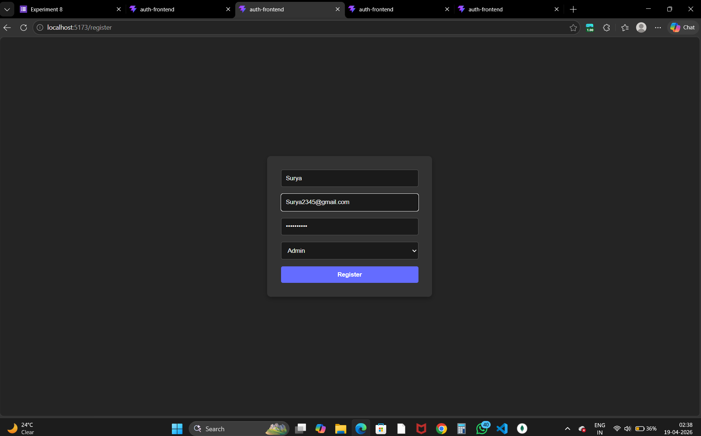
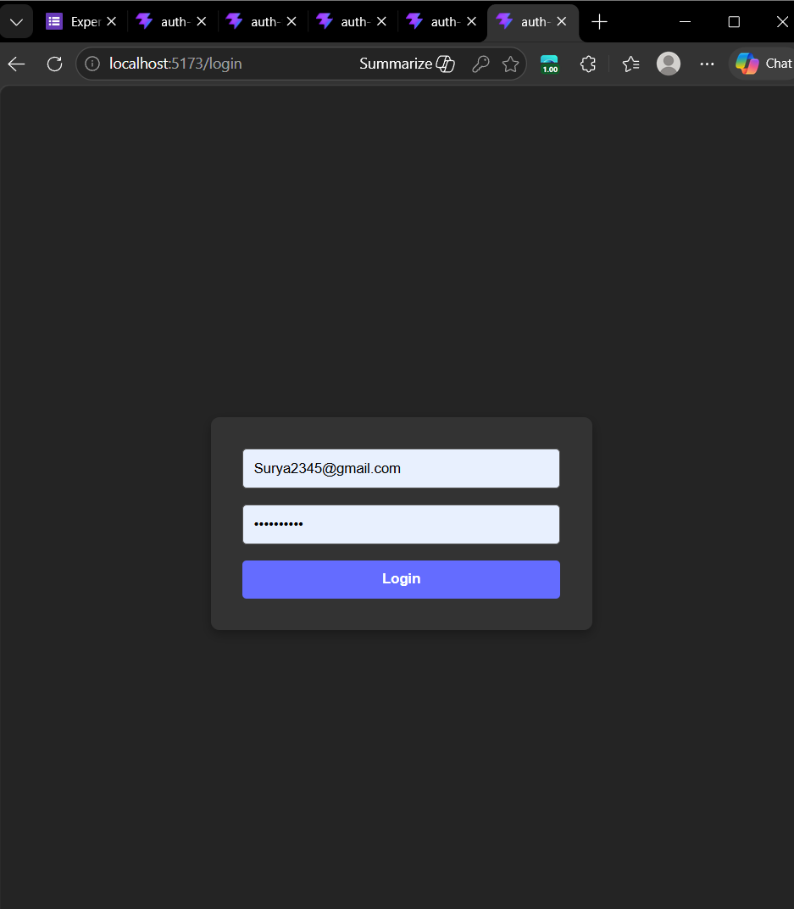
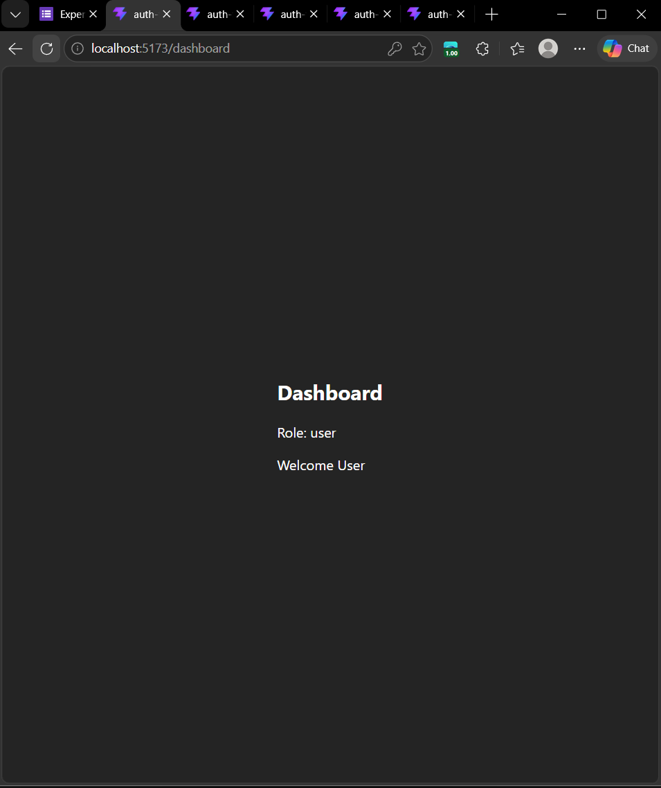
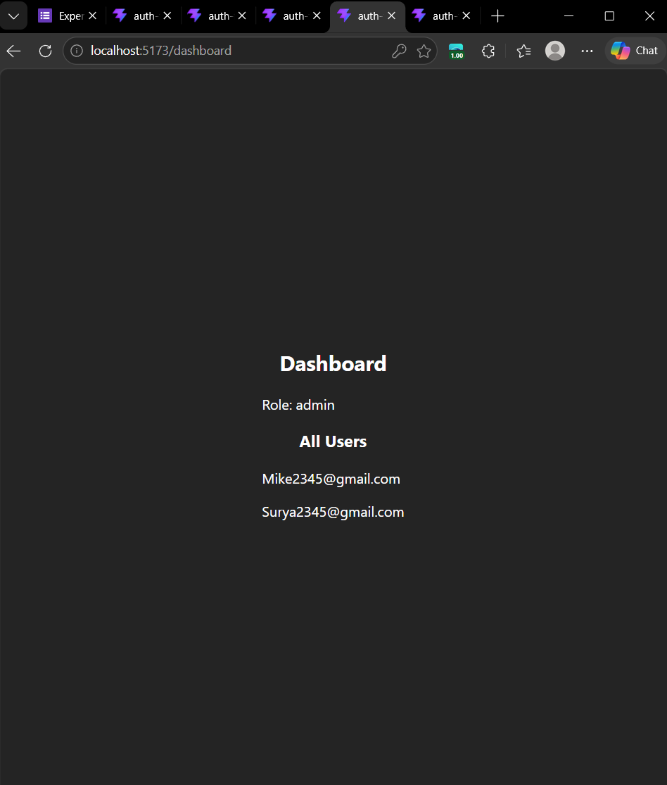
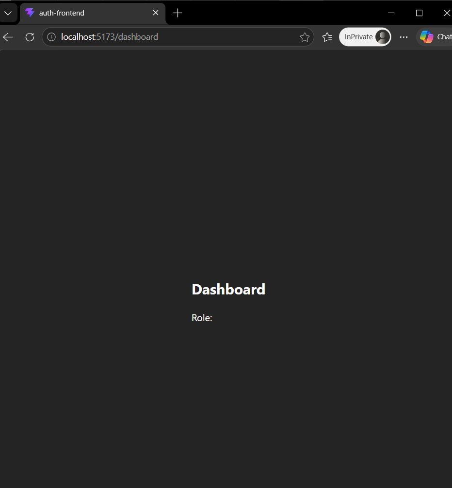
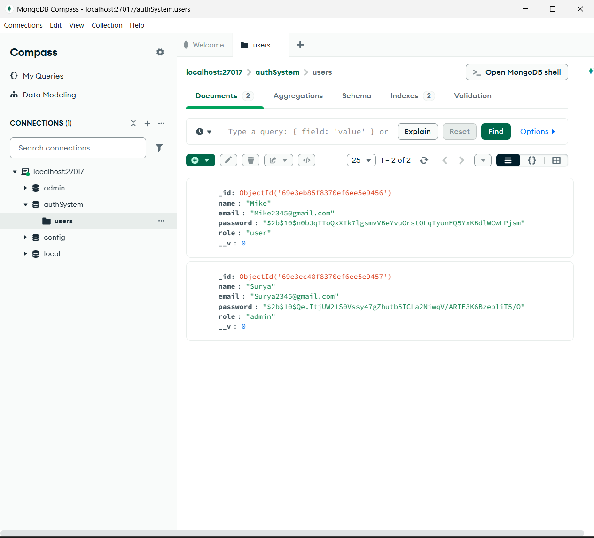

# Experiment 8: Full Stack Authentication System (JWT + RBAC)

**Name:** Ayush Sharma  
**UID:** 24BAI70874  

## Project Overview
This project implements a secure Full Stack Authentication System with Role-Based Access Control (RBAC). It demonstrates the integration of a React frontend with a Node/Express backend and MongoDB database, secured using JSON Web Tokens (JWT).

---

## 🚀 Tech Stack
- **Frontend:** React (Vite) + Axios + React Router
- **Backend:** Node.js + Express
- **Database:** MongoDB
- **Security:** JWT + Hashed Passwords (bcrypt) + RBAC

---

## 📂 Project Structure
```text
auth-system/
│
├── backend/             # Node.js & Express Server
│   ├── config/          # DB Connection (db.js)
│   ├── controllers/     # Auth Logic (authController.js)
│   ├── middleware/      # JWT & Role Verification
│   ├── models/          # User Schema (User.js)
│   └── routes/          # API Endpoints (authRoutes.js)
│
├── frontend/            # React Application
│   └── src/
│       ├── pages/       # Login, Register, Dashboard
│       └── App.jsx      # Routing Logic
│
└── screenshots/         # Proof of Execution (6 Mandatory Screens)

---

## 📸 Proof of Execution

### 1. Registration Page


### 2. Login Page


### 3. User Dashboard


### 4. Admin Dashboard


### 5. Protected Route (Unauthorized Access)


### 6. MongoDB Database (Compass)
